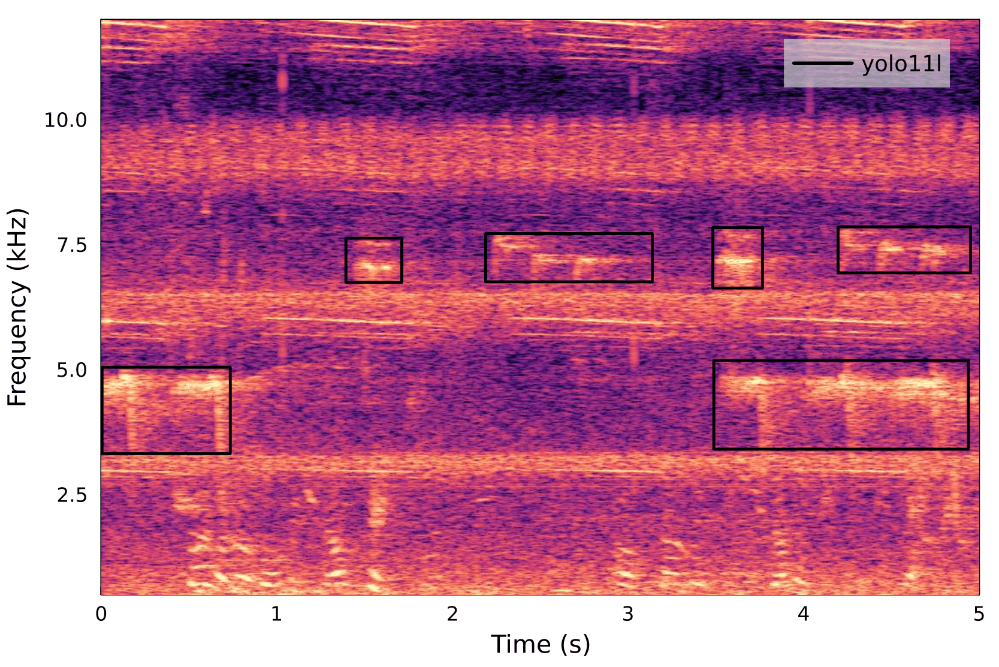

# BirdBox

Paper: [Time-frequency localization of bird calls in dense soundscapes](https://arxiv.org/abs/2606.10407)

BirdBox is a framework for time–frequency localization of bird vocalizations in spectrograms using custom-trained [YOLO11](https://docs.ultralytics.com/) architectures.

The example below shows predictions from the `models/yolo11l.pt` detector on a 5-second recording from Singapore. Bird vocalizations are localized in time and frequency while insect noise, human speech, and other background sounds are ignored.



---

## First time setup

```bash
git clone https://github.com/org-arl/birdwatch.git
cd birdwatch
julia --project=. birdbox/setup.jl
```

---

## Get started

Walk through [`get_started.jl`](get_started.jl) for how to run a pre-trained
model on a recording and how to train a custom model. The example uses a 30-second recording from Hawaii ([source](https://zenodo.org/records/7078499)).

---

## Use a pre-trained model

Two detectors pre-trained on soundscapes from Singapore are included in the `models/` directory. The smallest `yolo11n.pt` model achieves comparable performance to `yolo11l.pt` on our test sets but at ~10x lower parameter count:

<table>
  <thead>
    <tr>
      <th>Model</th>
      <th align="right">Parameters</th>
      <th>Test set</th>
      <th align="right">mAP@50</th>
      <th align="right">F1</th>
      <th align="right">Precision</th>
      <th align="right">Recall</th>
      <th align="right">Best conf. threshold</th>
    </tr>
  </thead>
  <tbody>
    <tr>
      <td rowspan="2" valign="middle"><code>yolo11n</code></td>
      <td rowspan="2" valign="middle" align="right">2.6M</td>
      <td>Singapore (in-distribution)</td>
      <td align="right">0.874</td>
      <td align="right">0.817</td>
      <td align="right">0.852</td>
      <td align="right">0.785</td>
      <td align="right">0.234</td>
    </tr>
    <tr>
      <td>Hawaii (out-of-distribution)</td>
      <td align="right">0.558</td>
      <td align="right">0.577</td>
      <td align="right">0.568</td>
      <td align="right">0.586</td>
      <td align="right">0.177</td>
    </tr>
    <tr>
      <td rowspan="2" valign="middle"><code>yolo11l</code></td>
      <td rowspan="2" valign="middle" align="right">25.3M</td>
      <td>Singapore (in-distribution)</td>
      <td align="right">0.871</td>
      <td align="right">0.819</td>
      <td align="right">0.816</td>
      <td align="right">0.822</td>
      <td align="right">0.179</td>
    </tr>
    <tr>
      <td>Hawaii (out-of-distribution)</td>
      <td align="right">0.574</td>
      <td align="right">0.601</td>
      <td align="right">0.582</td>
      <td align="right">0.622</td>
      <td align="right">0.171</td>
    </tr>
  </tbody>
</table>

Detections are matched to ground-truth boxes using IoMin@0.5 (see the [paper](https://arxiv.org/abs/2606.10407) for details). The reported precision, recall and F1-score values are obtained at the confidence threshold where the F1-score peaks.

Use either model to detect bird calls in new recordings:

```julia
using BirdBox
detections = detect("examples/example.wav", "models/yolo11n.pt")
```

The returned `DataFrame` has one row per detection with columns:

| column                                  | meaning                                                  |
|-----------------------------------------|----------------------------------------------------------|
| `source`                                | spectrogram PNG filename                                   |
| `class`, `confidence`                   | YOLO class id and confidence score                       |
| `xcenter`, `ycenter`, `width`, `height` | YOLO-normalized bounding box coordinates                             |
| `t0`, `t1`                              | detection start/end time in seconds (absolute in the recording) |
| `f0`, `f1`                              | detection low/high frequency in Hz                       |

---

## Train a custom model

To train a custom model, you need spectrogram images and matching .txt files with ground-truth bounding boxes in YOLO format.

### Spectrogram images

Generate spectrogram PNGs from a recording with:

```julia
using BirdBox
write_spectrogram_images("examples/example.wav")
```

### Ground truth labels

There are two practical ways to obtain bounding box labels in YOLO format:

1. **Use an open-source dataset.** Some public collections include
   time-frequency bounded labels — for example, the
   [Hawaii soundscape collection](https://zenodo.org/records/7078499)
   (635 recordings, ~51 hours, ~60k bounding boxes, 27 species). Make sure to convert the
   dataset's annotation format to YOLO-style `.txt` labels before training.

2. **Annotate your own recordings.** [BirdWatch](../birdwatch/) is a lightweight,
   open-source browser-based annotation tool built exactly for this.

   1. Open [BirdWatch](https://org-arl.github.io/birdwatch-public/).
   2. Point it at local directories containing spectrogram images and audio files.
   3. Draw bounding boxes on the spectrograms and save the labels directly in YOLO
      format.

### Data split

YOLO training expects a `data.yaml` and `.txt` files listing the image paths
for the train, val, and test splits. See
[`get_started.jl`](get_started.jl) for an example of how to generate these.

### Training

Fine-tune from one of the Singapore detectors:

```julia
using BirdBox
train("models/yolo11n.pt", "data/data.yaml";
    epochs = 300, patience = 50, batch = 16)
```

Pass `yolo11n.pt` to start from COCO pre-trained weights instead of the Singapore checkpoints. The appropriate COCO weights will be downloaded automatically based on the model name (`yolo11n.pt`, `yolo11s.pt` etc.).

For other YOLO architectures and hyperparameter options, see the
[Ultralytics documentation](https://docs.ultralytics.com/).
