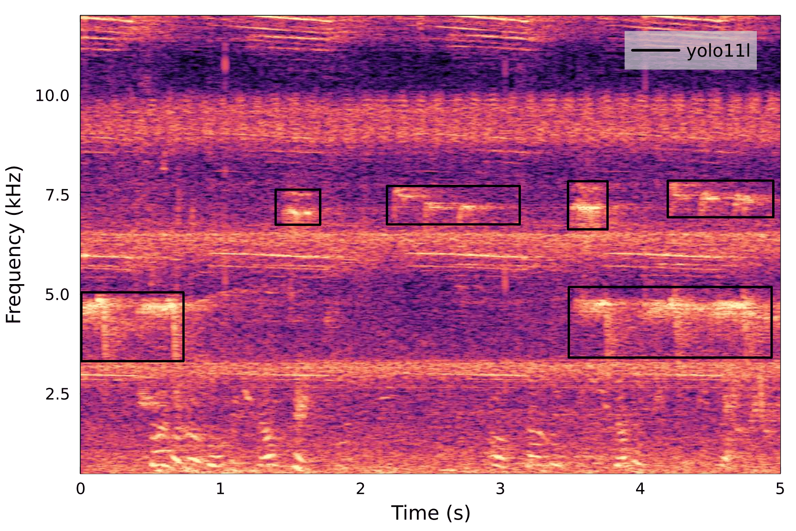

# BirdBox

Paper: [Time-frequency localization of bird calls in dense soundscapes](https://arxiv.org/abs/2606.10407)

BirdBox localizes bird vocalizations in time and frequency from raw audio using custom-trained [YOLO11](https://docs.ultralytics.com/) or [RF-DETR](https://github.com/roboflow/rf-detr) detectors.

The example below shows predictions from the `models/yolo11l.pt` detector on a 5-second recording from Singapore. Bird vocalizations are localized in time and frequency while insect noise, human speech, and other background sounds are ignored.



---


## First time setup

```bash
git clone https://github.com/org-arl/birdwatch-public.git
cd birdwatch-public
julia --project=. birdbox/setup.jl
```

`setup.jl` creates conda environments, install dependencies and downloads four model checkpoints into `birdbox/models/` from [GitHub Release](https://github.com/org-arl/birdwatch-public/releases/download/models-v1/) if they are not already present.

---


## Get started

See`get_started.jl](get_started.jl)` for examples of how to run pre-trained models on a recording and to train custom YOLO or RF-DETR models. The examples uses a 30-second recording from Hawaii ([source](https://zenodo.org/records/7078499)).

---


## Use a pre-trained model

Four detectors pre-trained on soundscapes from Singapore are provided. `setup.jl` places them in `models/`. The RF-DETR models performs best overall, but `yolo11n.pt` achieves decent performance at ~12x lower parameter count:


| Model                        | Parameters | Test set                    | mAP@50 | F1    | Precision | Recall | Best conf. threshold |
| ---------------------------- | ---------- | --------------------------- | ------ | ----- | --------- | ------ | -------------------- |
| `yolo11n`                    | 2.6M       | Singapore (in-distribution) | 0.874  | 0.817 | 0.852     | 0.785  | 0.234                |
||| Hawaii (out-of-distribution) | 0.558      | 0.577                       | 0.568  | 0.586 | 0.177     |        |                      |
| `yolo11l`                    | 25.3M      | Singapore (in-distribution) | 0.871  | 0.819 | 0.816     | 0.822  | 0.179                |
||| Hawaii (out-of-distribution) | 0.574      | 0.601                       | 0.582  | 0.622 | 0.171     |        |                      |
| `rfdetr-nano`                | 30.5M      | Singapore (in-distribution) | 0.896  | 0.831 | 0.848     | 0.813  | 0.330                |
||| Hawaii (out-of-distribution) | 0.618      | 0.631                       | 0.611  | 0.653 | 0.296     |        |                      |
| `rfdetr-large`               | 33.9M      | Singapore (in-distribution) | 0.903  | 0.836 | 0.819     | 0.853  | 0.293                |
||| Hawaii (out-of-distribution) | 0.638      | 0.646                       | 0.619  | 0.675 | 0.310     |        |                      |


Detections are matched to ground-truth boxes using [IoMin@0.5](mailto:IoMin@0.5) (see the [paper](https://arxiv.org/abs/2606.10407) for details). The reported precision, recall and F1-score values are obtained at the confidence threshold where the F1-score peaks.

Use a model to detect bird calls in new recordings:

```julia
using BirdBox
detections = detect("examples/example.wav", "models/yolo11n.pt"; backend = :yolo)
# detections = detect("examples/example.wav", "models/rfdetr-nano.pth"; backend = :rfdetr)
```

The returned `DataFrame` has one row per detection with the following columns:


| column                                  | meaning                                                         |
| --------------------------------------- | --------------------------------------------------------------- |
| `source`                                | spectrogram PNG filename                                        |
| `class`, `confidence`                   | class id and confidence score                                   |
| `xcenter`, `ycenter`, `width`, `height` | YOLO-normalized bounding box coordinates                        |
| `t0`, `t1`                              | detection start/end time in seconds (absolute in the recording) |
| `f0`, `f1`                              | detection low/high frequency in Hz                              |


---


## Train a custom model

To train a custom model, you need spectrogram images and matching `.txt` files with ground-truth bounding boxes in YOLO format.

### Spectrogram images

Generate spectrogram PNGs from a recording with:

```julia
using BirdBox
write_spectrogram_images("examples/example.wav")
```


### Ground truth labels

There are two practical ways to obtain bounding box labels in YOLO format:

1. **Use an open-source dataset.** Some public collections include
  time-frequency bounded labels — for example, the
   [Hawaii soundscape collection](https://zenodo.org/records/7078499)
   (635 recordings, ~51 hours, ~60k bounding boxes, 27 species). Make sure to convert the
   dataset's annotation format to YOLO-style `.txt` labels before training.
2. **Annotate your own recordings.** [BirdWatch](../birdwatch/) is a lightweight,
  open-source browser-based annotation tool built exactly for this.
  1. Open [BirdWatch](https://org-arl.github.io/birdwatch-public/).
  2. Point it at local directories containing spectrogram images and audio files.
  3. Draw bounding boxes on the spectrograms and save the labels directly in YOLO
    format.


### Data split

Write `.txt` files listing the image paths for the train, val, and test splits. See
`[get_started.jl](get_started.jl)` for an example (`write_split_file`).

### YOLO

YOLO training expects a `data.yaml` pointing at those split files:

```julia
using BirdBox
write_data_yaml()
train("models/yolo11n.pt", "data/data.yaml";
    epochs = 300, patience = 50, batch = 16)
```

Pass `yolo11n.pt` (not a path under `models/`) to start from COCO pre-trained weights instead of the Singapore checkpoints. The appropriate COCO weights will be downloaded automatically based on the model name (`yolo11n.pt`, `yolo11s.pt` etc.).

For other YOLO architectures and hyperparameter options, see the
[Ultralytics documentation](https://docs.ultralytics.com/).

### RF-DETR

The below example zero-pads spectrogram images to 1024×1024 and trains a RF-DETR nano model starting from the Singapore-trained checkpoint. To start from Roboflow pre-trained weights, pass `:nano` or `:large` instead of a `.pth` path. Set `ENV["RFDETR_PYTHON"]` to the `birdbox-rfdetr` environment's Python (see setup above). 

```julia
using BirdBox
write_padded_dataset("data/rfdetr"; train = "data/train.txt", val = "data/val.txt")
train("models/rfdetr-nano.pth", "data/rfdetr";
    backend = :rfdetr, epochs = 100, patience = 10, batch = 16)
```

---


## SAM 3

SAM 3 is a foundation model for promptable segmentation in images and videos. We evaluated it in our [paper](https://arxiv.org/abs/2606.10407), but do not include the model checkpoint here because RF-DETR performed better in our experiments and the SAM 3 checkpoint is large (3.6 GB). For instructions on fine-tuning SAM 3, see our [paper](https://arxiv.org/abs/2606.10407) and the official [SAM 3 repository](https://github.com/facebookresearch/sam3).