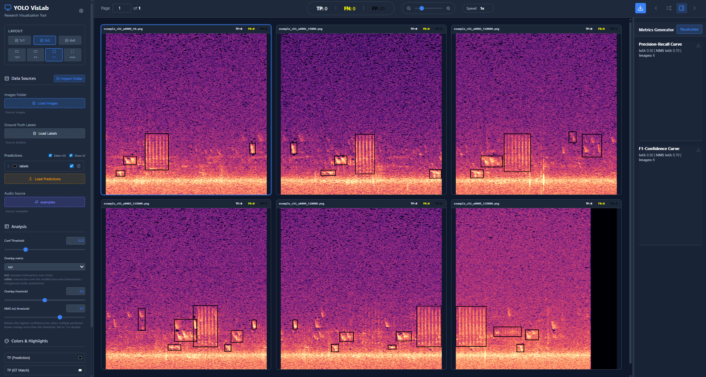

# BirdWatch

BirdWatch is a browser-based spectrogram annotation and analysis tool. It supports manual labeling, audio playback, and evaluation of detection model outputs, with all processing performed locally in the browser.

Although developed for bioacoustic applications and YOLO-based detectors, it can be used for other spectrogram annotation tasks.



---

## Features

**Playback** — Listen to a full spectrogram clip, or isolate any sound by drawing a bounding box around it.

**Annotation** — Enable *Edit mode* in the sidebar and draw bounding boxes to label sounds of interest. Labels are saved in YOLO format: `class cx cy w h` (coordinates normalized 0–1).

**Performance analysis** — Given ground truth labels and model predictions, BirdWatch lets you:
- Visualize true positives, false positives and false negatives
- Plot precision-recall curves and F1-confidence curves
- Interactively adjust confidence and NMS thresholds and see the effect instantly

---

## Getting Started

Open the app: **[BirdWatch →](https://simhex.github.io/birdwatch/)**

### Load data

Use the “Import Folder” option to load all data at once. If you do, organize your directory as follows:

```
data/
├── images/       # Spectrograms (.png, .jpg)
├── audio/        # Full audio clips (.wav, .ogg, .mp3, .m4a)
├── labels/       # Ground truth annotations (YOLO TXT format)
└── predictions/  # Model output annotations (YOLO TXT format)
```

Each folder can also be imported individually from the sidebar; no specific folder structure is required in that case.

> **Important:** Open *Advanced Settings* (top left) and set the min/max frequency and clip duration to match your spectrograms. Incorrect values will break playback timing and annotation coordinates.

---

## File Naming

BirdWatch links each spectrogram to its position in an audio file via the filename. Images and their label files must follow this pattern:

```
{audio_prefix}_t{start_ms}.ext
```

where `{audio_prefix}` matches the audio filename (without extension) and `{start_ms}` is the clip's start time in milliseconds.

### Example

| File | Role |
|---|---|
| `audio/birdrec.wav` | Audio recording |
| `images/birdrec_t0.png` | Spectrogram from 0 ms |
| `images/birdrec_t6000.png` | Spectrogram from 6000 ms |
| `labels/birdrec_t0.txt` | YOLO boxes for `birdrec_t0.png` |
| `labels/birdrec_t6000.txt` | YOLO boxes for `birdrec_t6000.png` |

---

## Limitations

- Currently supports binary (event detection) classification only.

---

## Contributing

Feature requests, bug reports, and PRs are welcome — just open an issue or pull request.

